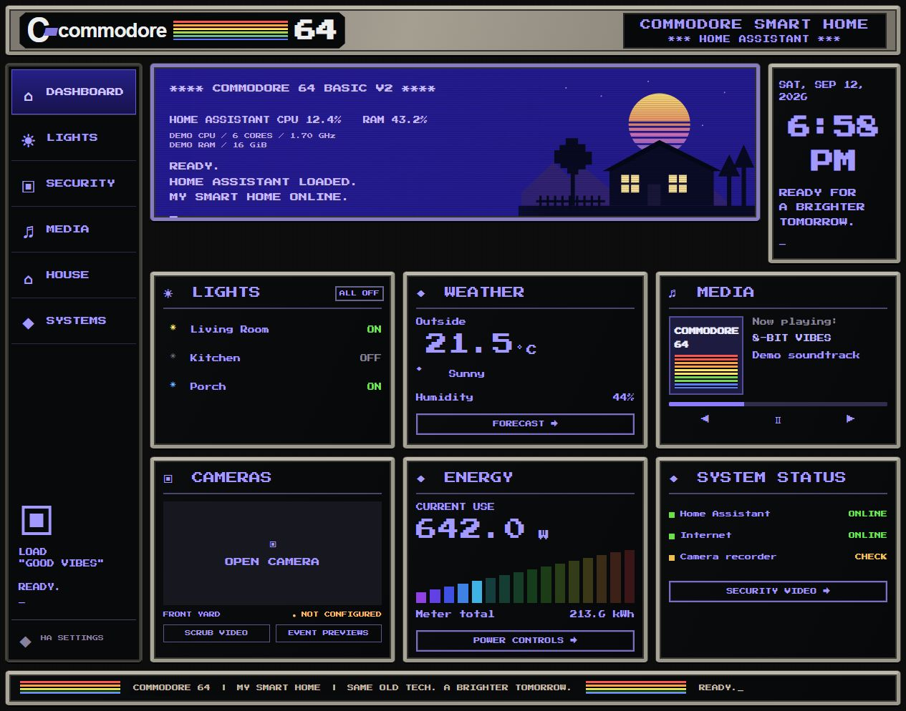
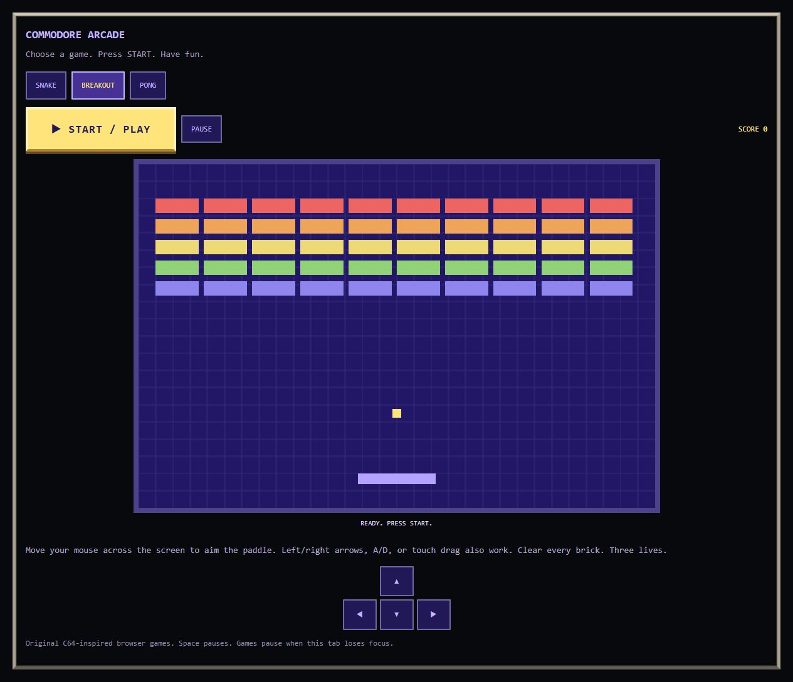

# Commodore 64 Home Assistant Panel

A Commodore 64-inspired dashboard for Home Assistant: a blue BASIC-style welcome screen, pixel lettering, metal borders, and working home controls. One main view with subsections keeps the dashboard organized.



**Screenshots use demonstration entities and values.** They show the packaged interface, not a live household. Camera images are intentionally omitted; icon rendering in the standalone preview is approximate. Your devices and readings appear after you configure the example entities.

## Features

- Overview for lights, weather, music, camera access, energy, and system status.
- Live CPU and RAM percentages, with editable hardware specifications.
- 12-hour clock and entity-provided measurement units.
- Subsections with standard Home Assistant cards.
- Optional Frigate recordings, timeline review, and event thumbnails through Advanced Camera Card.
- Optional original Snake, Breakout, and Pong games with mouse, keyboard, and touch controls.
- Optional C64 emulator library with visible mouse cursor, Fullscreen, and Escape / Release Controls.
- Local font and artwork; the base panel and included minigames need no external CDN.

The original Commodore look is retained, without rainbow strips across card headers. The familiar stripes remain in the Commodore branding and artwork.

## What this package contains

| File | Purpose |
| --- | --- |
| `dashboard.yaml` | Full example dashboard; replace every `example` entity |
| `themes/commodore64.yaml` | Home Assistant colour theme |
| `www/commodore64/commodore64-panel.js` | Overview and subsection renderer |
| `www/commodore64/c64-arcade-card.js` | Optional browser minigames and emulator library launcher |
| `www/commodore64/c64-library.html` | Isolated EmulatorJS player; empty private game catalog |
| `www/commodore64/c64-player-controls.js` | Readable source for controls embedded in the library |
| `docs/EMULATOR.md` | Private game setup, fullscreen and input controls |
| `optional-arcade.yaml` | Arcade group to add to the dashboard |
| `optional-frigate-card.yaml` | Optional camera review examples |
| `docs/CONFIGURATION.md` | Field reference and customization notes |
| `docs/AI-CUSTOMIZATION.md` | Instructions and a prompt for an AI assistant |
| `docs/TROUBLESHOOTING.md` | Common installation problems |
| `screenshots/` | Desktop and Arcade previews |
| `FONT-LICENSE.txt` | Press Start 2P font attribution and licence |

No personal entity inventory, login tokens, camera footage, bark detection, game ROM collection, BIOS files, or bundled third-party emulator is included. The optional Arcade contains three original browser games and an emulator launcher. The emulator runtime downloads from the official EmulatorJS CDN when used. Its game catalog is empty; add games privately using [the emulator guide](docs/EMULATOR.md).

## Requirements

- Home Assistant with dashboard resources and raw configuration editing available.
- The files in this repository, installed manually. This is **not a HACS repository or integration**.
- Your own light, weather, media, camera, and sensor entities for the features you use.
- Optional: Frigate, its Home Assistant integration, and Advanced Camera Card for recorded video review.

This package was prepared against a Home Assistant 2026-era frontend. Older versions have not been comprehensively tested. There is no card-mod dependency.

## Install

1. On GitHub, choose **Code → Download ZIP**, then extract it. Open the folder containing this README.
2. Copy `www/commodore64` into `/config/www/commodore64` on Home Assistant.
3. Copy `themes/commodore64.yaml` into `/config/themes/commodore64.yaml`.
4. If themes are not already enabled, merge this into `configuration.yaml`. Keep a single `frontend:` section:

   ```yaml
   frontend:
     themes: !include_dir_merge_named themes
   ```

   Check configuration before restarting. If themes are already enabled, reload themes instead.
5. Enable **Advanced mode** in your Home Assistant profile. Open **Settings → Dashboards → Resources** and add:

   | URL | Resource type |
   | --- | --- |
   | `/local/commodore64/commodore64-panel.js?v=github1` | JavaScript Module |

   For YAML-managed resources, use this entry beneath your existing `lovelace.resources` list:

   ```yaml
   - url: /local/commodore64/commodore64-panel.js?v=github1
     type: module
   ```
6. Create a **new empty dashboard**. In its raw configuration editor, paste the contents of `dashboard.yaml`.
7. Replace all `example` entity IDs with your own IDs from **Developer Tools → States**. Update both the top-level overview fields and the cards inside `groups`.
8. Save, refresh the browser, and select the **Commodore 64** theme if necessary.

Keep the supplied group/page IDs when changing their display names: overview buttons navigate to those IDs. This installs a separate dashboard; it does not replace Home Assistant's generated Overview or change other dashboards.

## Add the optional Arcade

1. Add `/local/commodore64/c64-arcade-card.js?v=github2` as another **JavaScript Module** resource.
2. Copy the object in `optional-arcade.yaml` as an additional item in the main card's `groups` list. Indent it consistently with the existing Lights and Security groups.
3. Refresh and open **Arcade → Games**.



| Game | Mouse / touch | Keyboard |
| --- | --- | --- |
| Snake | Click or drag toward a direction | Arrows or WASD |
| Breakout | Move horizontally over the screen | Left/right or A/D |
| Pong | Move vertically over the screen | Up/down or W/S |

Press the large gold **START / PLAY** button. Space pauses. Games pause when the tab loses focus and stop when the card is removed. They run on the viewing device, not as a process on the Home Assistant server.

### Optional C64 emulator

ROM collection: [Commodore 64 ROM Set (US) on Internet Archive](https://archive.org/details/commodore-64-romset-us). Game files are downloaded separately and are not bundled in this repository.

Choose **C64 EMULATOR → OPEN GAME LIBRARY**. Follow [Emulator setup](docs/EMULATOR.md) to add your own games. The mouse stays visible. Use **FULLSCREEN** to enlarge the player; **Esc** exits fullscreen and releases controls. **RELEASE CONTROLS** frees keyboard input, and clicking the game resumes it.

The Arcade screenshot above shows the original minigames; the emulator controls are an additional feature.

## Optional security video

Install Frigate and Advanced Camera Card separately. In `optional-frigate-card.yaml`, copy the object beneath `recordings_card` or `events_card` into the appropriate page's `cards` list. Do not paste those wrapper keys as a card.

Replace camera IDs and configure retention in your own Frigate installation. This package does not set retention, create cameras, enable detection, or install security automations. Recordings and thumbnails depend on your existing integrations and retained footage.

## Customize with an AI assistant

You may give the extracted files or GitHub repository URL to an AI assistant to create new dashboards. Include only the relevant entity IDs and your desired rooms, sections, colours, and controls. Read [the AI customization guide](docs/AI-CUSTOMIZATION.md) for a ready-to-use prompt.

## Updating and removing

Before updating, save your customized YAML and the previous JavaScript files. Replace the resource files, increment their URL version (for example `github2`), and refresh. Merge new example YAML into your dashboard rather than overwriting your entity mappings.

To uninstall, remove the dashboard and its resource entries. Delete its copied files only when no other dashboard uses them. The package does not create or delete your devices.

## Credits and licensing

This is an unofficial community project, not affiliated with Commodore or Home Assistant. Commodore names and marks belong to their respective owners. The package includes an original, unbranded SVG sunset illustration.

Press Start 2P: copyright 2012 The Press Start 2P Project Authors, distributed under the SIL Open Font License 1.1. See `FONT-LICENSE.txt`. No project-wide open-source licence has been selected yet; the font's licence applies to the font only. Add a licence of your choice for the code before advertising the repository under a particular open-source licence.

## Documentation

- [Home Assistant dashboards](https://www.home-assistant.io/dashboards/)
- [Home Assistant frontend themes](https://www.home-assistant.io/integrations/frontend/)
- [Advanced Camera Card](https://github.com/dermotduffy/advanced-camera-card)

See [release notes](CHANGELOG.md) for this package's contents and validation scope.
